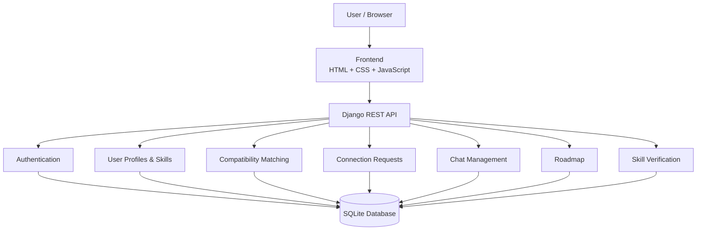

<div align="center">

# 🌊 Coral Reef

### *Where Knowledge Unites*

**A Skill Exchange Platform for Learning, Teaching & Growing Together**

<p>
  <strong>4th Year B.Tech CSE Major Project</strong><br>
  G H Raisoni University, Amravati<br>
  Department of Computer Science and Engineering<br>
  Academic Session 2026–27
</p>

<p>
  
  
  
  
</p>

<p>
  <strong>Project Guide:</strong> Prof. Mr Amol Dhankar
</p>

</div>

---

## 📖 About Coral Reef

**Coral Reef — Where Knowledge Unites** is a skill-exchange platform designed to help people discover compatible learning partners, exchange skills, communicate with one another, verify skills, and follow structured learning paths.

Instead of treating learning as a one-directional process, Coral Reef is designed around **peer-to-peer knowledge exchange**:

> **I can teach what I know, while learning what someone else knows.**

The platform combines skill-based matching, connection requests, communication, skill verification and learning-roadmap concepts into one application.

---

## 🎯 Problem Statement

People often have useful skills they can teach but may struggle to find suitable learning partners. At the same time, learners may find it difficult to identify people whose skills, interests and learning goals complement their own.

Coral Reef addresses this problem by creating a platform where users can:

- Create a personal skill profile.
- Select skills they can teach.
- Select skills they want to learn.
- Discover compatible users.
- Compare skill compatibility.
- Send and manage connection requests.
- Communicate with accepted connections.
- Work toward skill verification.
- Follow a structured learning roadmap.

---

## 💡 Proposed Solution

Coral Reef organizes the learning journey into connected stages:

```text
Create Profile
      ↓
Add Teaching & Learning Skills
      ↓
Find Compatible Users
      ↓
Check Compatibility
      ↓
Send Connection Request
      ↓
Accept Connection
      ↓
Start Conversation
      ↓
Verify Skills
      ↓
Follow Learning Roadmap
      ↓
Grow Together
```

The platform is designed so that important actions lead to meaningful pages, modals, forms or API operations instead of relying only on static interface elements.

---

# ⭐ Core Features

The project focuses on four core features.

### 1. 🎯 Skill Compatibility Score

The matching system compares:

- Skills a user wants to learn with another user's teaching skills.
- Skills a user can teach with another user's learning skills.

The result includes a compatibility score along with the relevant teaching and learning skills.

### 2. 💬 Chat

Connected users can communicate through one-to-one conversations.

Current implementation includes:

- Conversation creation.
- Conversation list.
- Message history.
- Sending messages.
- Sent/received message alignment.
- Persistent messages stored through the backend.
- Account-to-account communication.

### 3. 🛡️ Skill Verification

The platform includes a skill-verification workflow designed around:

- Selecting a skill.
- Starting a verification assessment.
- Answering questions.
- Moving through the assessment.
- Viewing the verification result.
- Retaking an assessment.
- Coding-challenge interaction.

Backend persistence for the complete verification workflow is still under development.

### 4. 🗺️ Learning Roadmap

The roadmap feature provides a structured learning journey based on a user's learning goal.

Current interface includes:

- Learning goal input.
- Roadmap generation.
- Step-based learning timeline.
- Progress indicator.
- Mark-complete interaction.

Backend persistence and deeper progress tracking are still under development.

---

# ✨ Supporting Features

Along with the four core features, Coral Reef currently includes:

- 🔐 User registration and login
- 👤 User profiles
- 🧑‍💻 Teaching-skill management
- 📚 Learning-skill management
- 🔎 Skill exploration and search
- 🤝 Connection requests
- 🔔 Connection notifications
- 📊 User dashboard
- 🖼️ Profile images
- 🌐 Social-profile information
- 📱 Responsive navigation
- 📱 Mobile, tablet and desktop layouts
- 📄 Shared navigation and footer components
- ⚡ Django REST API integration

---

# 🧭 User Journey

| Step | Stage | What the user does |
|---|---|---|
| 01 | 🔎 Discover | Explore available skills and users |
| 02 | 👤 Join | Register and create a profile |
| 03 | 🎓 Choose | Add teaching and learning skills |
| 04 | 🎯 Match | Discover compatible learning partners |
| 05 | 🤝 Connect | Send or respond to connection requests |
| 06 | 💬 Communicate | Chat with accepted connections |
| 07 | 🛡️ Prove | Work through skill-verification features |
| 08 | 🗺️ Grow | Follow learning-roadmap activities |

---

# 🏗️ System Architecture



### Application Layers

**Presentation Layer**
- HTML
- CSS
- JavaScript
- Responsive UI
- Shared navigation/footer components

**Application Layer**
- Django
- Django REST Framework
- Authentication
- Matching logic
- Connection management
- Chat APIs

**Data Layer**
- SQLite database
- Django models
- Persistent user, connection and chat data

---

# 🧰 Technology Stack

| Layer | Technologies |
|---|---|
| Frontend | HTML5, CSS3, JavaScript |
| Backend | Python, Django |
| API | Django REST Framework |
| Database | SQLite |
| Authentication | Django REST Framework Token Authentication |
| Version Control | Git |
| Repository | GitHub |
| Development | VS Code / Terminal / Browser |

---

# 📁 Repository Structure

```text
Coral-Reef-Skill-Exchange/
│
├── 01_Documentation/
├── 02_Research_Papers/
├── 03_PPT/
├── 04_Project_Report/
├── 05_UI_Design/
│
├── 06_Frontend/
│   ├── assets/
│   ├── components/
│   ├── css/
│   ├── js/
│   ├── pages/
│   └── index.html
│
├── 07_Backend/
│   ├── coralreef/
│   ├── user_management/
│   ├── chat_management/
│   ├── manage.py
│   └── requirements.txt
│
├── 08_Database/
├── 09_Testing/
├── 10_Screenshots/
├── 11_Meeting_Notes/
├── 12_Poster/
├── 13_Final_Submission/
├── 14_Demo_Video/
│
├── .github/
│   ├── CODEOWNERS
│   └── pull_request_template.md
│
├── .gitignore
├── CONTRIBUTING.md
├── CONTRIBUTORS.md
└── Project_Information.md
```

---

# 🚀 Getting Started

## Prerequisites

Install the following before running the project:

- Python 3
- Git
- A modern web browser
- Terminal / Command Prompt

---

## 1. Clone the Repository

```bash
git clone https://github.com/Nikhilrsingh/Coral-Reef-Skill-Exchange.git
cd Coral-Reef-Skill-Exchange
```

---

## 2. Set Up the Backend

Move into the backend directory:

```bash
cd 07_Backend
```

Create a virtual environment:

### macOS / Linux

```bash
python3 -m venv venv
source venv/bin/activate
```

### Windows

```bash
python -m venv venv
venv\Scripts\activate
```

Install dependencies:

```bash
pip install -r requirements.txt
```

Apply migrations:

```bash
python manage.py migrate
```

Start the Django server:

```bash
python manage.py runserver
```

The backend will normally be available at:

```text
http://127.0.0.1:8000/
```

---

## 3. Start the Frontend

Open another terminal and move to the frontend:

```bash
cd 06_Frontend
```

Start a local HTTP server:

```bash
python3 -m http.server 5500
```

On Windows, if `python3` is unavailable:

```bash
python -m http.server 5500
```

Open:

```text
http://127.0.0.1:5500/index.html
```

> The frontend communicates with the Django API running on port `8000`.

---

# 🔌 API Overview

The frontend communicates with the Django REST backend through API endpoints.

| Area | Endpoint |
|---|---|
| User API | `/api/users/` |
| User Matches | `/api/users/<id>/matches/` |
| Connection Requests | `/api/requests/` |
| Chat Conversations | `/api/chat/conversations/` |
| Conversation Messages | `/api/chat/conversations/<id>/messages/` |

The exact API behavior is implemented in the Django backend and connected to the frontend modules.

---

# 🔐 Authentication

The current frontend authentication flow uses Django REST Framework token authentication.

The frontend stores the authentication token locally and sends it with protected API requests.

Important local development files such as:

```text
db.sqlite3
venv/
.env
```

are excluded from Git through `.gitignore`.

### Security Notes

Never commit:

- Passwords
- API keys
- Authentication tokens
- `.env` files containing secrets
- Local databases
- Virtual environments

---

# 📊 Current Development Status

| Module | Status |
|---|:---:|
| Project UI & responsive design | ✅ |
| Shared navigation & footer | ✅ |
| User registration | ✅ |
| User login/authentication | ✅ |
| User profile | ✅ |
| Teaching & learning skills | ✅ |
| Skill exploration | ✅ |
| Compatibility matching | ✅ |
| Compatibility score | ✅ |
| Connection requests | ✅ |
| Notifications | ✅ |
| Dashboard | ✅ |
| One-to-one chat | ✅ |
| Persistent chat messages | ✅ |
| Learning roadmap UI | 🔄 |
| Roadmap backend persistence | 🔄 |
| Skill verification UI | 🔄 |
| Verification backend persistence | 🔄 |
| Complete testing cycle | 🔄 |
| Final documentation | 🔄 |
| Final submission preparation | 🔄 |

**Legend:**  
✅ Completed / working  
🔄 In development

The status intentionally reflects the current development stage rather than marking unfinished backend work as complete.

---

# 🧪 Testing

Testing is being performed throughout development rather than only at the end.

Current testing areas include:

- Registration and login
- Authentication state
- Profile updates
- Teaching/learning skill updates
- Skill matching
- Compatibility score
- Connection requests
- Accept/reject workflow
- Dashboard notifications
- Chat conversation creation
- Message sending
- Message persistence
- Responsive navigation
- Mobile layouts
- Page-to-page navigation
- Form validation

The final testing phase will additionally cover complete end-to-end workflows and remaining roadmap/verification backend functionality.

---

# 🌿 Git & GitHub Workflow

The repository follows a branch-based contribution workflow.

```text
main
 │
 ├── feature/...
 ├── fix/...
 └── docs/...
```

Recommended workflow:

```bash
git checkout -b feature/your-feature
```

Make your changes, test them, then:

```bash
git add .
git commit -m "feat: describe your change"
git push origin feature/your-feature
```

After pushing, create a Pull Request targeting `main`.

### Example Branch Names

```text
feature/skill-verification
feature/learning-roadmap
feature/chat-improvements
feature/frontend-ui
fix/responsive-ui
fix/backend-validation
docs/project-report
```

More contribution guidelines are available in [`CONTRIBUTING.md`](CONTRIBUTING.md).

---

# 👥 Project Team

### Academic Project Team — 2026–27

| Name | Roll No. | GitHub | Role |
|---|---|---|---|
| **Nikhil Singh** | H-CSE-06 | [@Nikhilrsingh](https://github.com/Nikhilrsingh) | Project Lead & Primary Developer |
| **Jeeya Vaswani** | F-71 | To be added | Research, Documentation & Presentation |
| **Rizviya Shaikh** | F-66 | To be added | Research, Testing & Documentation |
| **Tharvesh Khorgade** | F-55 | To be added | Testing, UI/UX Feedback & Presentation |
| **Manthan Rakas** | F-2 | To be added | Documentation, Testing & Presentation |
| **Yash Bawankar** | F-70 | To be added | Research, Testing & Presentation |

For the detailed contribution record, see [`CONTRIBUTORS.md`](CONTRIBUTORS.md).

> Technical Git commits and Pull Requests should represent actual contributions and should not be created artificially for project credit.

---

# 👨‍🏫 Academic Information

| Information | Details |
|---|---|
| University | G H Raisoni University, Amravati |
| Department | Computer Science and Engineering |
| Program | B.Tech — Computer Science & Engineering |
| Project Type | 4th Year Major Project |
| Academic Session | 2026–27 |
| Project | Coral Reef — Where Knowledge Unites |
| Guide | Prof. Mr Amol Dhankar |

---

# 📚 Documentation

The repository is organized to keep development and academic material separate.

| Folder / File | Purpose |
|---|---|
| `01_Documentation/` | Project documentation |
| `02_Research_Papers/` | Research material |
| `03_PPT/` | Presentations |
| `04_Project_Report/` | Major project report |
| `05_UI_Design/` | UI/UX design material |
| `09_Testing/` | Testing material |
| `10_Screenshots/` | Application screenshots |
| `11_Meeting_Notes/` | Project meeting records |
| `12_Poster/` | Posters |
| `13_Final_Submission/` | Final submission material |
| `14_Demo_Video/` | Demonstration video material |
| `Project_Information.md` | Project-wide academic and technical information |
| `CONTRIBUTORS.md` | Team and contribution information |
| `CONTRIBUTING.md` | GitHub contribution workflow |

---

# 🔮 Future Development

Planned development includes:

- Complete backend persistence for skill verification.
- Persistent learning-roadmap progress.
- Deeper verification result management.
- Expanded testing and validation.
- Additional production-level error handling.
- Further UI/UX refinement.
- More detailed project analytics where appropriate.
- Final academic documentation and submission preparation.

---

# 🌊 Project Vision

Coral Reef is based on a simple idea:

> **Everyone knows something worth sharing, and everyone has something new to learn.**

The platform aims to turn individual skills into meaningful peer-learning connections where users can **discover, match, connect, communicate, verify and grow together.**

---

<div align="center">

### 🌊 Coral Reef — Where Knowledge Unites

**G H Raisoni University, Amravati**  
**Department of Computer Science and Engineering**  
**Academic Session 2026–27**

<br>

Made as a B.Tech CSE Major Project.

</div>
